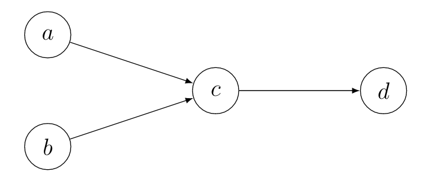

[English](/en/2020/09/03/itaa1/) | Deutsch

## Einführung

Willkommen zu **Einführung in Abstrakte Argumentation**, Teil I!
Zum Zeitpunkt des Verfassen dieses Eintrags habe ich fast meine Bachelorarbeit fertiggestellt, die von Abstrakter Argumentation handelt.
Bevor ich mit meiner Bachelorarbeit begonnen habe wusste ich fast nichts über das Thema, habe mich dennoch sehr schnell in das Thema eingearbeitet und eine gewisse Leidenschaft für die Thematik gewonnen.

Da das Anlesen und Verständnis der Konzepte viel Lesen wissenschaftlicher Paper in Anspruch nahm und ich viel noch aus der Perspektive eines Einsteigers sehe möchte ich hier gerne meine Erkenntnisse in kurzer und einfach verständlicher Weise teilen.

**Wichtiger Hinweis:** Ich werde hier die meiste Zeit nicht Zitieren und stattdessen relevante Papers am Ende eines Eintrags verlinken. Daher rate ich davon ab diese Einträge als Quelle zu verwenden, besonders in einem akademischen Kontext. Ich kann keine (mathematischen) Korrektheit garantieren, auch wenn ich natürlich versuche, so akurat wie möglich zu verbleiben.

## Was ist Abstrakte Argumentation?
Tauchen wir nun direkt ins Thema ein und klären, worüber ich hier schreiben möchte! Abstrakte Argumentation ist ein Forschungsteilgebiet der Künstlichen Intelligenz. Es wurde von Dung mit einem heute sehr populären und viel referenzierten  Paper aus dem Jahre 1995 begründet.
Die Grundidee ist, ein Problem in der Form von Argumenten und Angriffen zwischen den Argumenten zu modellieren. Wie der Name Abstrakte Argumentation schon sagt, beschäftigen wir uns mit abstrahierten Argumenten, was bedeuted, dass der Inhalt der Argumente für unser Interesse nicht mehr relevant ist. Werfen wir einen Blick auf ein vereinfachtes Beispiel:

Nehmen wir an es ist Nachmittag und ich möchte meinen Freund überraschen, dessen Geburstag heute ist. Ich debattiere nun, wo ich ihn am wahrscheinlichsten antreffen werde, da ich einige seiner Gewohnheiten kenne:

- **a**: An seinem Geburstag nimmt er sich üblicherweise Urlaub von seiner Arbeit.
- **b**: Er verlässt seine Arbeit üblicherweise mittags.
- **c**: Meist arbeitet er tagsüber im Büro.
- **d**: Er geht gerne im Park spazieren.

Lasst und also darüber einen Moment nachdenken. Wie Argument $d$ sagt, läuft er gerne durch den Park, aber ich weiß auch, dass er tagsüber arbeitet, daher greift Argument $c$ Argument $d$ an und es ist wahrscheinlicher, ihn im Büro anzutreffen, als im Park.
Ich weiß außerdem, dass er sich die letzten Jahren an seinem Geburtstag frei nahm, daher greift Argument $a$ Argument $d$ an und er ist wahrscheinlich nicht in seinem Büro. Weiterhin ist es bereits nachmittags und um diese Zeit ist er üblicherweise bereits fertig mit der Arbeit: Argument $b$ greift ebenfalls Argument $c$ an.

Mit was wir es hier zu tun haben, ist ein sogenanntes Argumentation Framework. Die Argumente werden von der Menge $Ar = \lbrace a, b, c, d\rbrace$ repräsentiert. Die Angriffe werden mit der binären Relation $att = \lbrace(a,c), (b,c), (c,d)\rbrace$ ausgedrückt. Ein Argumentation Framework ist nun die Kombination aus Argumenten und Angriffen: $AF = (Ar, att)$.

Es ist nun relativ naheliegend das Framework als gerichteten Graphen darzustellen, der übliche Weg Frameworks zu visualisieren. Der Graph unseres Frameworks sieht folgendermaßen aus:

## Zum Weiterlesen...
Wir haben nun die ersten Schritte in Richtung Abstrakte Argumentation getan, womit wir mit dem Inhalt des ersten Posts er Serie fertig sind. Sollte Interesse an den mathematischen/theoretischen Hintergründen dieses Eintrags bestehen, empfehle ich einen Blick in [Dung's paper](https://www.sciencedirect.com/science/article/pii/000437029400041X) von 1995 zu werfen. Ansonsten sehen wir uns im nächsten Post wieder!