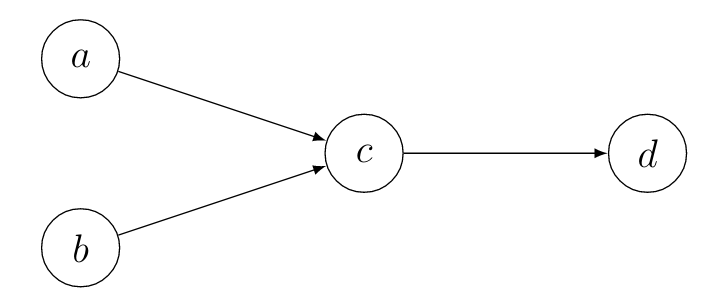

[English](/en/2020/09/06/itaa2/) | Deutsch

## Los gehts!
Willkommen zu **Einführung in Abstrakte Argumentation**, Teil **2**!
Heute behandeln wir das Thema Admissibility! Wenn du den letzten Eintrag verpasst hast, lese dich ein in [Einführung in Abstrakte Argumentation 1](/2020/09/03/itaa1/). Im weiteren Verlauf der Reihe werden viele wichtige Begrifflichkeiten fallen; um so nah wie möglich an der Literatur zu verbleiben und keine Verwirrung durch ungenau übersetzte Fachbegriffe zu erzeugen werde ich diese Begrifflichkeiten trotz deutschen Texts in englischer Sprache belassen. Ein deutsch-englischer Mischmasch lässt sich daher nicht vermeiden, diesen nehme ich aber zugunsten höherer Genauigkeit gerne in Kauf.

Bevor wir starten, erinnern wir uns an das Argumentation framework aus dem letzten Eintrag: $AF = (\lbrace a,b,c,d\rbrace,\lbrace(a,c),(b,c),(c,d)\rbrace)$.

## Conflict-freeness
Das erste Thema, das wir betrachten ist die conflict-freeness, oder *Konflikt-Freiheit*. Nehmen wir an, wir haben eine Menge $S \subseteq Ar$, also eine Untermenge unserer Argumente. Dann ist diese Menge conflict-free, wenn es keine Angriffe zwischen Argumenten innerhalb der Menge gibt. Formal, conflict-freeness gilt, wenn $\forall a,b \in S: (a,b) \notin att$. Nehmen wir uns die Menge $S_1 = \lbrace a,b\rbrace$, dann ist $S_1$ conflict-free. Die Menge $S_2 = \lbrace c,d\rbrace$ ist dagegen nicht conflict-free. Wir werden gleich sehen, warum diese Definition wichtig ist.

## Defense
Die nächste Definition ist etwas komplexer. Es geht um defense, oder *Verteidigung*. Eine Menge defended ein Argument, wenn für jeden Angriff auf dieses Argument, ein Argument in der Menge widerum diesen Angreifer angreift. Formal defended eine Menge $S$ ein Argument $a$, wenn $\forall b, (b,a) \in att: \exists c \in S, (c,b) \in att$. Zum Beispiel wird das Argument $d$ in unserem Beispiel von der Menge $S_1$ defended.

## Admissibility
Wir sind nun beim wichtigen Teil gelandet: admissibility, oder *Zulässigkeit*. Eine Menge ist admissible, wenn sie conflict-free ist und alle ihre Argumente defended. In unserem Beispiel, die Menge $S_1$ ist admissible, während die Menge $S_2$ nicht admissible ist. Tatsächlich sind die admissible Mengen $\lbrace a,b,d \rbrace$, $\lbrace a,b\rbrace$, $\lbrace a,d\rbrace$, $\lbrace b,d\rbrace$, $\lbrace a\rbrace$, $\lbrace b\rbrace$ and $\lbrace\rbrace$.

Dass eine Menge admissible ist, heißt, dass wir die Sicht dieser Argumente in einer Debatte einnehmen können, da wir keine Widersprüche in unserer Argumentation haben. Weiter können wir jeden Angriff auf unsere Argumente kontern, da wir jedes angreifende Argument anzweifeln, indem wir es unsererseits angreifen.

## Fazit

Tatsächlich ist das Konzept der Admissibility ein Zentrales in der Abstrakten Argumentation und stammt aus *Dungs* ursprünglichen Paper und wird uns noch eine ganze Weile begleiten.
Deshalb empfehle ich erneut [Dung's paper](https://www.sciencedirect.com/science/article/pii/000437029400041X) als Lektüre. Bis nächstes mal!