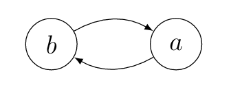

[English](/en/2020/09/22/itaa3/) | Deutsch

## Los gehts!
Willkommen zu **"Introduction to Abstract Argumentation"**, Teil 3!
Das heutige Thema werden **Extension-basierte Semantiken** sein. Damit betreten wir das Herz der abstrakten Argumentation, weshalb das Thema Semantiken nicht nur in den nächsten Einträgen vertieft wird, sondern immer eine wichtige Rolle spielen wird.

## Semantiken und Extensions
Wagen wir uns zunächst an den ersten Begriff: **Extension**. Wikipedia definiert eine **Extension** eines Konzepts als die Menge, die durch das Konzept spezifiziert wird. In unserem Fall sind **Semantiken** unsere Konzepte, und damit die **Extensions** einer **Semantik** die Menge, die durch die Semantik beschrieben wird. Leicht zu erraten ist an dieser Stelle, was für Mengen das sind, es sind natürlich Mengen von Argumenten. Damit haben wir direkt erschlossen, was eine **Semantik** tut: *Eine Semantik ist eine Funktion, die ein Argumentation Framework als Input entgegen nimmt und Menge von Argumenten zurückgibt*. Diese Mengen, oder **Extensions** sind nun Mengen von akzeptablen Argumenten. Wie jede bisherige Definition, geht auch dieses Konzept auf Dung zurück:

Let $AF=(Ar, att)$ be an argumentation framework and  $S \subseteq Ar$ a set,
then we denote its powerset by $2^S$.
An extension-based *semantics* is a function $\sigma$ such that for every
argumentation framework $AF = (Ar,att)$, we have $\sigma(AF)$ $\in$ $2^{2^{Ar}}$.
The elements of $\sigma(AF)$ are called *extensions*.

Wir haben also etabliert, dass wir auf ein konkretes Argumentation Framework eine Semantik anwenden, die uns widerrum (mehrere) Untermengen unserer Argumente zurückgibt und dass diese Untermengen Extensions heißen. Gehen wir aber nochmal genauer auf diese **Extensions** ein. Ich habe erwähnt, dass die Argumente dieser Mengen *"akzeptiert* werden. Doch was genau bedeutet das?

Stellen wir uns vor, wir sind Teil einer Debatte, in der verschiedene Argumente hervorgebracht werden, ganz ähnlich zu den Argumenten des Beispiels aus dem [ersten Eintrag](/2020/09/03/itaa1/). Es ist klar, dass sich diese Argumente gegenseitig angreifen, zustimmen, widersprechen, ... können. Und es ist nun die Aufgabe einer Jury oder eines Moderators die Argumente anzunehmen oder abzulehnen, beziehungsweise den Gewinner der Debatte zu bestimmen. Übertragen auf unsere Definition ist dieser Vorgang das Anwenden einer Semantik auf die Argumente. Damit sind also die resultierenden **Extensions** die Argumente, die als *"gültig"* ermittelt wurden, also die Argumente die in eine schlüssige Argumentation vertreten. Offensichtlich gibt es verschiedene Auffassungen darüber, was eine *"schlüssige Argumentation"* ist, daher gibt es auch verschieden Semantiken. Sind wir beispielsweise der Meinung, dass nur der Gewinner der Debatte schlüssig argumentiert, dann entspricht das einer Semantik, die immer nur eine einzige Menge von Argumenten zurückgibt. Sind wir aber der Meinung, dass verschiedene Parteien schlüssig argumentierten, dann entspricht das einer Semantik die auch mehrere **Extensions** zulässt, beispielsweise die Argumente der Partei 1 und die Menge der Argumente der Partei 2.

## Preferred Semantik
Das nun eine ganze Menge theoretischer Konzepte, also wollen wir diese direkt an einem konkreten Fall in Aktion erleben.
Dazu betrachten wir direkt eine relativ intuitive und populäre Semantik: **preferred**. Diese Semantik wurde ebenfalls von Dung vorgestellt und ist sehr weit verbreitet. Die **preferred** Semantik lässt jede **admissible** Menge als **Extension** zu, soweit sie im Sinne der Mengenlehre maximal ist, formal:

Let $AF = (Ar, att)$ be an argumentation framework and $E \subseteq Ar$. $E$ is said to be a **preferred extension** iff $E$ is a maximal (with respect to set-inclusion) admissible set.

Führen wir uns ein neues Argumentation Framework vor Augen: $AF = (\lbrace a,b\rbrace,\lbrace(a,b),(b,a)\rbrace)$:

Wir können nun für jede Untermenge der Argumente prüfen, ob sie ein **preferred** extension ist:

- $\lbrace a,b\rbrace$: Die beiden Argumente $a$ und $b$ greifen sich gegenseitig an; damit besteht ein innerer Konflikt, die Menge ist nicht admissible und damit *keine preferred extension*.
- $\lbrace a\rbrace$: Das Argument $a$ wird von $b$ angegriffen, greift $b$ aber ebenfalls an. Die Menge verteidigt sich und ist damit admissible. Sie ist außerdem maximal und damit *ist sie eine preferred extension*.
- $\lbrace b\rbrace$: Das Argument $b$ wird von $a$ angegriffen, greift $a$ aber ebenfalls an. Die Menge verteidigt sich und ist damit admissible. Sie ist außerdem maximal und damit *ist sie eine preferred extension*.
- $\lbrace\rbrace$: Die leere Menge ist tatsächlich immer admissible. Allerdings ist sie in diesem Fall nicht maximal und damit *keine preferred extension*.

Wir haben nun jede potentielle **Extension** überprüft und können daher alle **preferred extensions** benennen: $\sigma(AF) = \lbrace\lbrace a\rbrace,\lbrace b\rbrace\rbrace$.

## Fazit

Mit dem Konzept der Semantiken haben wir das zentrale Werkzeug der abstrakten Argumentation kennengelernt. Außerdem haben wir uns mit einer der 4 wichtigsten Semantiken vertraut gemacht, der **preferred** Semantik.
Und auch hier referenziere ich [Dung's paper](https://www.sciencedirect.com/science/article/pii/000437029400041X) als Grundlage. Bis nächstes mal!