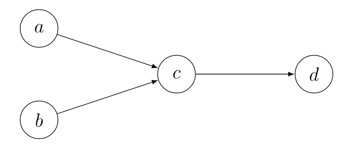

English | [Deutsch](/2020/09/06/itaa2/)

## Let's get started!
Welcome to **"Introduction to Abstract Argumentation"**, part **2**!
Today we are going to dive into admissibility! If you missed the last part, go check out [Introduction to Abstract Argumentation 1](/en/2020/09/03/itaa1/). Before we start, let us recall the argumentation framework from the last post: $AF = (\lbrace a,b,c,d\rbrace,\lbrace(a,c),(b,c),(c,d)\rbrace)$.

## Conflict-freeness
The first topic we are going to talk about is conflict-freeness. Let us suppose with have a set $S \subseteq Ar$, so a set of arguments. This set is then conflict-free if there is no attack between any arguments within the set. Formally, conflict-freeness holds, iff $\forall a,b \in S: (a,b) \notin att$. Suppose $S_1 = \lbrace a,b\rbrace$, then $S_1$ is conflict-free. The set $S_2 = \lbrace c,d\rbrace$ is not conflict-free. We will soon see, why this definition is important.

## Defense
The next definition is a bit more complicated. It is called defense. A set defends an argument, iff for every argument that attacks this argument, there is an argument in the set, that attacks this attacker. Formally, the argument $a$ is defended by the set $S$, iff $\forall b, (b,a) \in att: \exists c \in S, (c,b) \in att$. For example the set $S_1$ defends argument $d$ in our example.

## Admissibility
Now we're ready for the important part: admissibility. A set is admissible, iff it is conflict-free and it defends all its arguments. In our example, $S_1$ is admissible. Also $S_2$ is not admissible. In fact, the admissible sets are $\lbrace a,b,d \rbrace$, $\lbrace a,b\rbrace$, $\lbrace a,d\rbrace$, $\lbrace b,d\rbrace$, $\lbrace a\rbrace$, $\lbrace b\rbrace$ and $\lbrace\rbrace$.

That a set is admissible means that in a debate we can advocate for this set, because we have no contradictions in our argumentation, and every attack on one of our arguments can be "blocked" by also attacking the attacker and therefore doubting the truth of the attacking argument.

## Conclusion
In fact, the concept of admissibility is a very central one in abstract argumentation and originates from *Dungs* orginal paper and will accompany us again.
That is why I again recommend [Dung's paper](https://www.sciencedirect.com/science/article/pii/000437029400041X) as read again. See you next time!