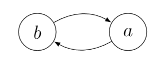

English | [Deutsch](/2020/09/22/itaa3/)

## Let's go!
Welcome to **"Introduction to Abstract Argumentation"**, part **3**!
Todays topic are extension-based semantics. With that we enter the heart of abstract argumentation, so the topic semantics will not only be intesified, but also accompany us throughout the rest of the series.

## Semantics and extensions
Let us start with the first keyword: extension. Wikipedia describes an extension of a concept as the set, that is specified by that concept. In our case semantics are the concept and so extensions result from the application of a semantics. It is esy to guess, what these sets might be in our case, they are of course sets of arguments. So by now we also know, what semantics do: *A semantics is a function that takes an Argumentation Framework as input and returns sets of arguments*. These sets or extensions are the acceptable arguments. Like every definition up to now, this concept originates from Dung:

Let $AF=(Ar, att)$ be an argumentation framework and  $S \subseteq Ar$ a set,
then we denote its powerset by $2^S$.
An extension-based *semantics* is a function $\sigma$ such that for every
argumentation framework $AF = (Ar,att)$, we have $\sigma(AF)$ $\in$ $2^{2^{Ar}}$.
The elements of $\sigma(AF)$ are called *extensions*.

So we established that if we apply a semantics on a precise argumentation framework, we will get subsets of all arguments and that these subsets are called extensions. But let is further dive into extensions. I mentioned that these arguments are *acceptable*. But what does that mean?

Let us imagine we are part of a debate, in which different arguments are brought forward, just like the arguments from the  [first entries example](/en/2020/09/03/itaa1/). It is obvious that these argements will attack, agree, contradict,  ... each other. And it's the jurys or moderators task, to accept and decline the arguments or determine the winner of the debate. Transferred to our definition, this process is the application of a semantics. So the resulting extensions are the arguments, that have been marked as *valid*, so the arguments that are part of a coherent reasoning. Obviously there are multiple opinions on what *"coherent reasoning"* is, so there are different semantics. Let's say we think only the debates winner reasons coherently, then this corresponds to a semantics that only returns one set of arguments. But would we advocate for the opinion that there might be different parties that are able to reason coherently, then this would correspond with a semantics, that allows multiple extensions to exist, for example all arguments of party 1 and all arguments of party 2.

## Preferred semantics
That was a load of theoretical concepts, so we want to see them in action in a concrete example. Therefore we will contemplate a pretty intuitive and popular semantics: **preferred**. This semantics has also been introduced by Dung and is widespread. The **preferred** semantics allows all admissible sets as extensions as long as they are maximal in respect to set-inclusion, formally:

Let $AF = (Ar, att)$ be an argumentation framework and $E \subseteq Ar$. $E$ is said to be a **preferred** extension iff $E$ is a maximal (with respect to set-inclusion) admissible set.

Let us think of a new argumentation framework: $AF = (\lbrace a,b\rbrace,\lbrace(a,b),(b,a)\rbrace)$:

We can now check every subset of arguments, if it is a **preferred** extension:

- $\lbrace a,b\rbrace$: The arguments $a$ and $b$ attack each other; therefore the set has a inner conflict, the set is not admissible and therefore no **preferred** extension.

- $\lbrace a\rbrace$: Argument $a$ is attacked by argument $b$, but also attacks $b$ itself. The set defends itself and is therefore admissible. It is also maximal and so it *is a preferred extension*.

- $\lbrace b\rbrace$: Argument $b$ is attacked by argument $a$, but also attacks $a$ itself. The set defends itself and is therefore admissible. It is also maximal and so it *is a preferred extension*.

- $\lbrace\rbrace$: The empty set is always admissible. But in our case it is not maximal and therefore *no preferred extension*.

We now checked every possible extension and can conclude all **preferred** extensions: $\sigma(AF) = \lbrace\lbrace a\rbrace,\lbrace b\rbrace\rbrace$.

## Conclusion

With the concept of semantics we gained access to the central tool of abstract argumentation. We also learned about one of the four most important semantics, the **preferred** semantics.
Again I will reference [Dung's paper](https://www.sciencedirect.com/science/article/pii/000437029400041X) as read. Until next time!