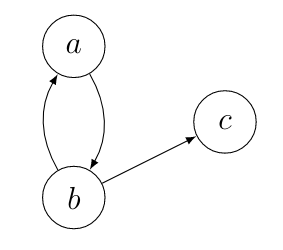

English | [Deutsch](/2020/09/26/itaa4/)

## Let's go!

Welcome to **Introduction to Abstract Argumentation**, part **4**!
In the [last entry](/2020/09/22/itaa3) we learned about semantics and got to know the **preferred** semantics.
In todays post we will learn about further admissibility-based semantics, namely the **stable semantics**.

## Todays AF
Other than in the previous posts, I want to establish a new argumentation framework $AF = (Ar, att)$ at the beginning of the post;
the arguments will be $Ar = \lbrace a,b,c\rbrace$ and the attacks will be $att = \lbrace(a,b),(b,a),(b,c)\rbrace$.

## Attacking and attacked sets
Before diving into the definition of the **stable** semantics, we need to learn about a new notation first.

For an argumentation framework $AF = (Ar, att)$ and a set $S \subseteq Ar$ we define $S^{+} = \lbrace a \in Ar \vert$
$S$ attacks $a$ $\rbrace$ and
$S^{-} = \lbrace a \in Ar \vert$ $a$ attacks $S$
$\rbrace$. Further, for an argument $a \in Ar$ we define $a^{+} = \lbrace b
\in Ar \vert$ $a$ attacks $b$ $\rbrace$ and $a^{-} = \lbrace b \in Ar \vert$ $b$
attacks $a$ $\rbrace$.

This definition is rather self-explanatory, it helps us expressing the relationship between sets of arguments, for example what arguments are attacked by a set.

Looking at todays AF and the set $S = \lbrace b, c\rbrace$, we notice that $S^+ = \lbrace a,c\rbrace$ and $S^- = \lbrace a\rbrace$.
Just taking argument $b$, we notice that also $b^+ = \lbrace a,c\rbrace$ and $b^- = \lbrace a\rbrace$.

## The stable semantics
We are now able to define what makes the **stable** semantics.

Let $AF = (Ar, att)$ be an argumentation framework and $E \subseteq Ar$.
$E$ is a **stable extension** iff $E^+ = Ar$ \ $E$.

Put into informal words, every set is a **stable** extension, if it attacks exactly all arguments, that are not in the set. Even though
not totally obvious, this also means that every **stable** extension is also admissible. Would there be any inner conflict, would the definition be violated, as only arguments that are not part of the set are to be attacked. Also every **stable** extension will always defend itself, as every argument that is not part of the set will be attacked, which includes potential attackers.

## The stable semantics in action
What are the **stable** extensions in todays AF? As we have only few arguments we can again use the naive approach of checking every possible subset of arguments.

- $\lbrace a,b,c\rbrace$. If this set would be an extension, it should only attack the empty set. In reality it attacks $\lbrace a,b,c\rbrace$, so itself. Therefore it is no **stable** extension.
- $\lbrace a,b\rbrace$. This set should only attack $\lbrace c\rbrace$, but attacks $\lbrace a,b,c\rbrace$. Again, no **stable** extension.
- $\lbrace a,c\rbrace$. This set attacks $\lbrace b\rbrace$, which is exactly $Ar$ \ $E$. So it is a **stable extension**!
- $\lbrace b,c\rbrace$. This set attacks $\lbrace a,c\rbrace$ and is therefore no **stable** extension.
- $\lbrace a\rbrace$. This set would have to attack $c$ and therefore is no **stable** extension.
- $\lbrace b\rbrace$. The set attacks exactly $\lbrace a,c\rbrace$ and is a **stable extension**.
- $\lbrace c\rbrace$. The set would have to attack $a$ and $b$, but attacks nothing, therefore no **stable** extension.
- $\emptyset$ is just a **stable** extension in the empty framework.

So the **stable** extensions are $\sigma(AF) = \lbrace \lbrace a,c\rbrace,\lbrace b\rbrace\rbrace$.

## Excursion: Labelings
When dealing with semantics and argumentation frameworks we always did and will do talk about the extension-based approaches. However there are other approaches, such as the **labeling**-based approach. It is about labelint arguments with *in* when accepted, *out* when rejected and *undec* when undecided. This approach gives us the same results, what arguments are to be accepted and what arguments are to be rejected and is therefore the same mechanism like extension-based approaches, just in a different cloak. Why the excursion then? The **stable** semantics has a nice property in combination with the labeling-approach:

There are no *undec* in **stable** extensions. Every argument within the extension is marked *in*, as it is accepted and every other argument is being attacked by the extension and therefore marked with *out*. This property is very interesting, as there are possible cases where we want to have an explicitly decided status for very argument, without any uncertainties.

## Conclusion
This completes the post about **stable** semantics. As always we are deep within Dung's territory and so I will reference [his paper](https://www.sciencedirect.com/science/article/pii/000437029400041X) at this point, like always. See you next time!